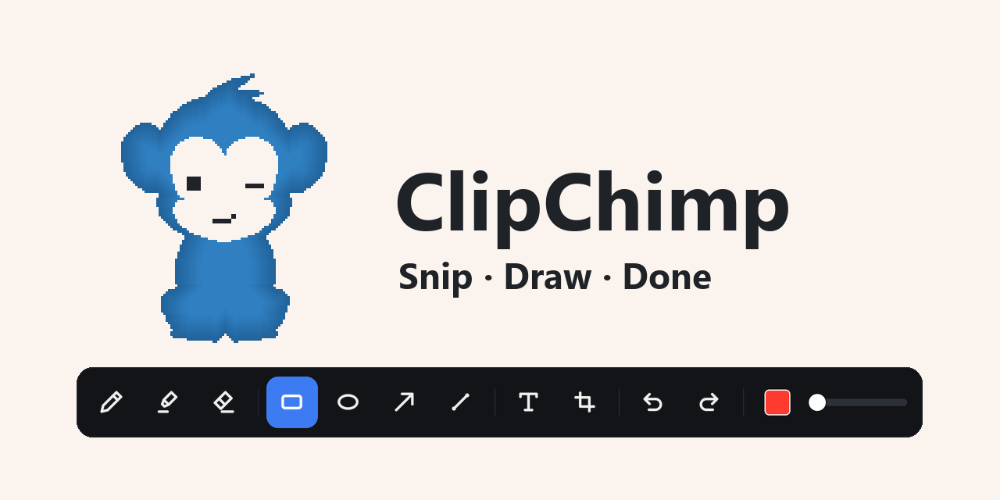
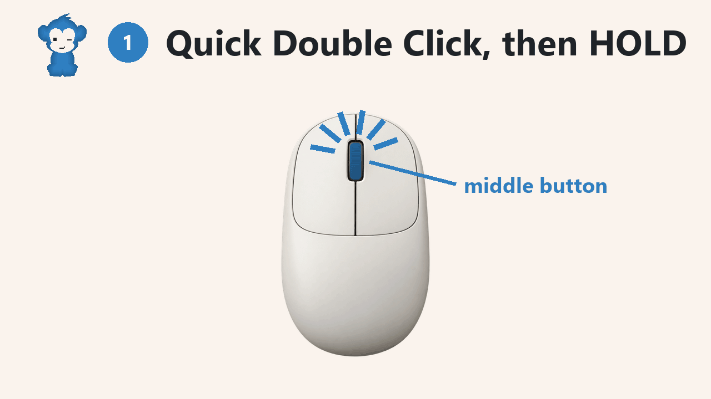
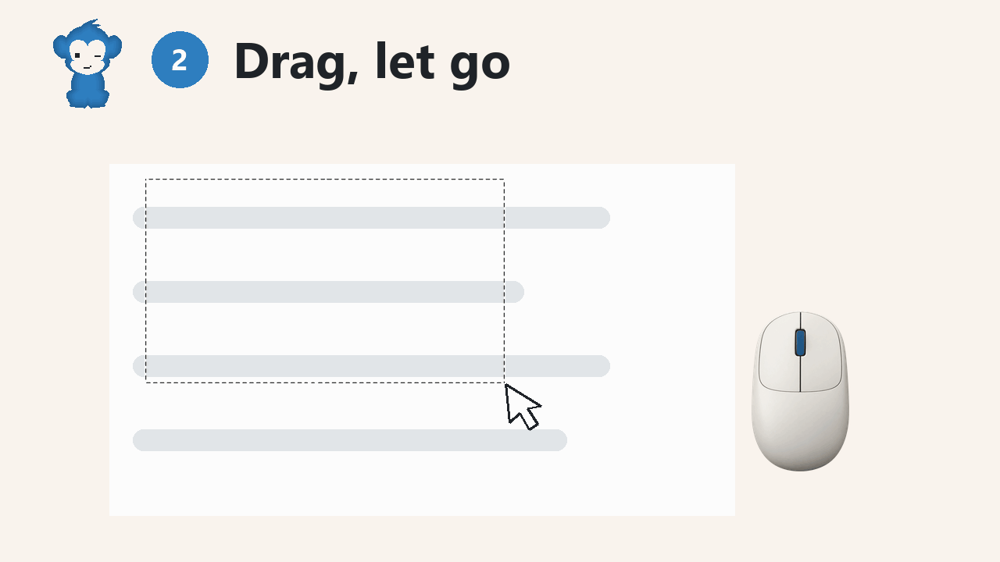
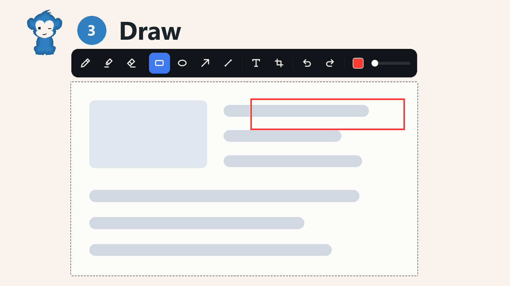
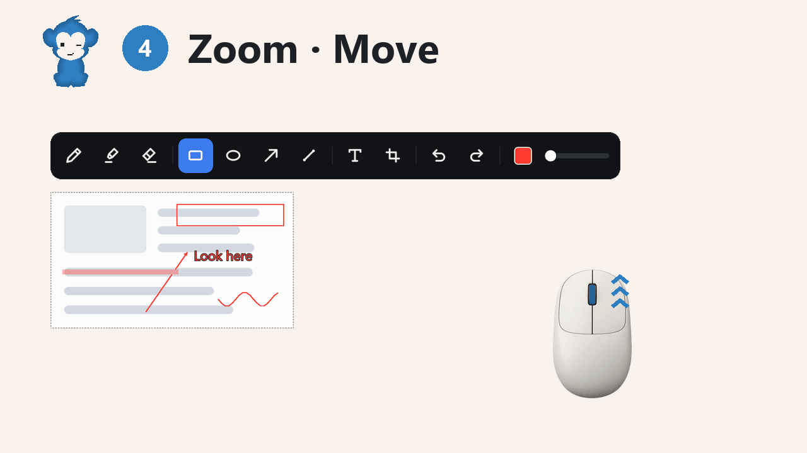
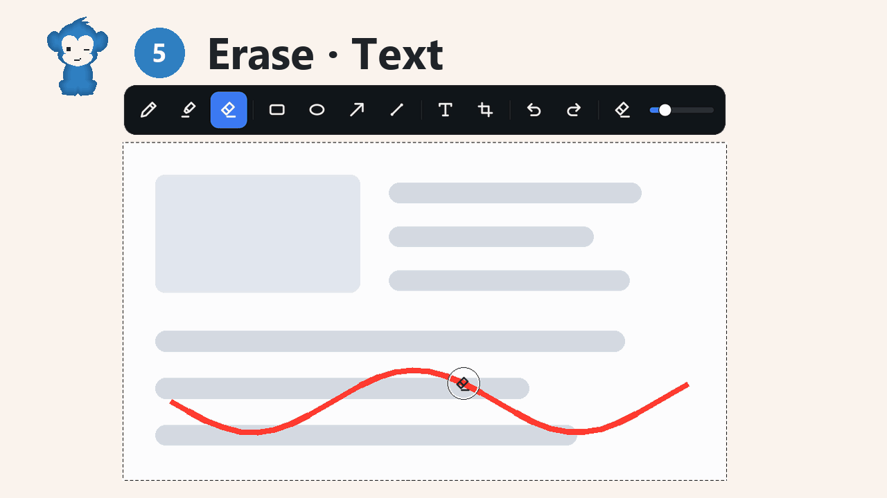
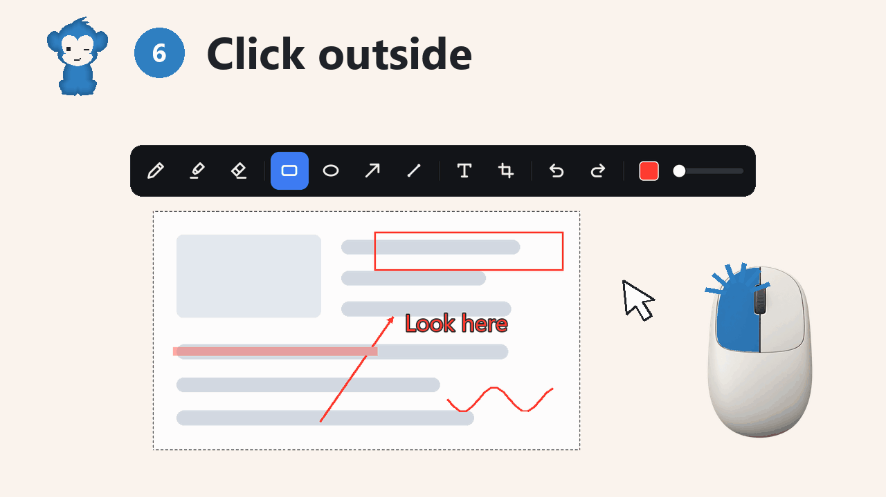

# ClipChimp

Snip. Edit. Save. For Windows.

Open source. A totally 100% unique clipping app that nobody has ever thought of.

## How to use

### 1. Middle button: quick double click, then hold.

### 2. Drag over what you want. Let go.

### 3. Draw.

### 4. Scroll to zoom. Right-drag to move.

### 5. Erase. Type text, then click to drop it.

### 6. Click outside. Saved in **Pictures › ClipChimp** and copied.

**Esc** cancels.

## Install

Run **ClipChimp-Setup** from [Releases](../../releases/latest). Click **Yes** once.

ClipChimp starts with Windows and waits in the tray. It runs as administrator, so it can snip any window.

Click the tray chimp to open your snips. Right-click it to pause or quit.

### From source

Get [Python 3](https://www.python.org/downloads/). Download the ZIP and unzip it. Right-click **install.ps1** › **Run with PowerShell**. This way cannot snip administrator windows.

## Remove

**Settings › Apps**, then uninstall **ClipChimp**. From source: press **Win + R**, type `shell:startup` and delete **ClipChimp**.

## License

MIT
