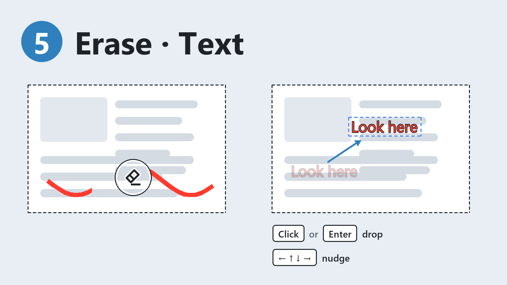

# ClipChimp

Snip. Edit. Save.

For Windows.

## How to use

### 1. Click the middle mouse button. Then quickly press it again and hold.

### 2. Keep holding and drag over what you want. Let go.

### 3. Draw.

### 4. Scroll to zoom. Right-drag to move.

### 5. The ring is what gets erased. Text follows you until you click.

### 6. Click outside. It is saved in **Pictures › ClipChimp** and copied.

**Esc** cancels.

## Install

1. Get [Python 3](https://www.python.org/downloads/) for Windows.
2. Download this page: green **Code** button, then **Download ZIP**. Unzip it.
3. Right-click **install.ps1** and pick **Run with PowerShell**. On Windows 11, click **Show more options** first.

That's it. ClipChimp now waits quietly and starts with Windows.

Keep the unzipped folder. ClipChimp runs from it.

## Remove

Press **Win + R**, type `shell:startup` and delete **ClipChimp**. Then restart your PC. Now you can delete the folder too.

## License

MIT
